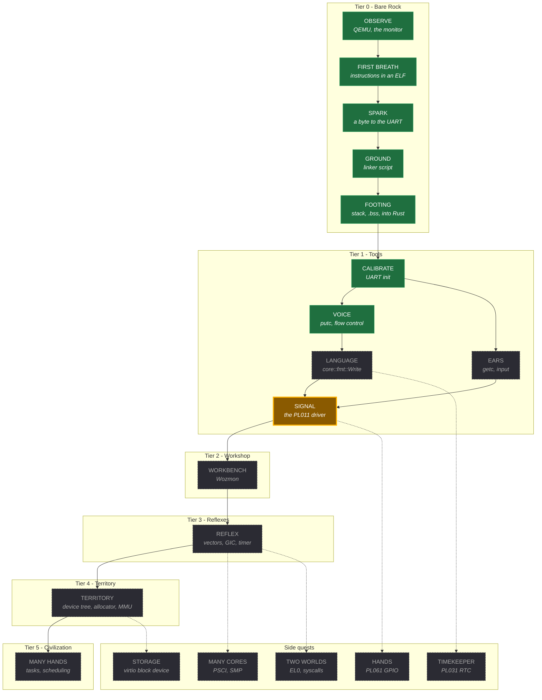

# Skill tree

High-level view. The authoritative version is `bd list` / `bd ready`; this is the picture.

Most nodes here expand into several atomic skills in beads - `WORKBENCH` alone is six, one per
Wozmon command. Those are deliberately kept out of the diagram so it stays readable.

Legend: **solid** = unlocked, **bold outline** = in progress, **dashed** = locked.

## Reading it

The arrows are real prerequisites, not a suggested order. `EARS` needs `CALIBRATE` because a
receive path on an unconfigured UART reads garbage. `WORKBENCH` needs the whole of `SIGNAL`
because Wozmon is nothing but reading hex in and printing hex out. `MANY CORES` needs `REFLEX`
because waking a second CPU without an exception mechanism gives you two things fighting over
one UART and no way to see it happen.

Solid arrows are the main line. Dashed arrows lead to side quests, which are optional and
teach something the main line skips.

## Keeping it current

The colours are hand-maintained and will drift. `bd ready` and `bd blocked` never do. When a
skill is closed in beads, move it to the `done` class here; when the next one is claimed, move
it to `active`.
